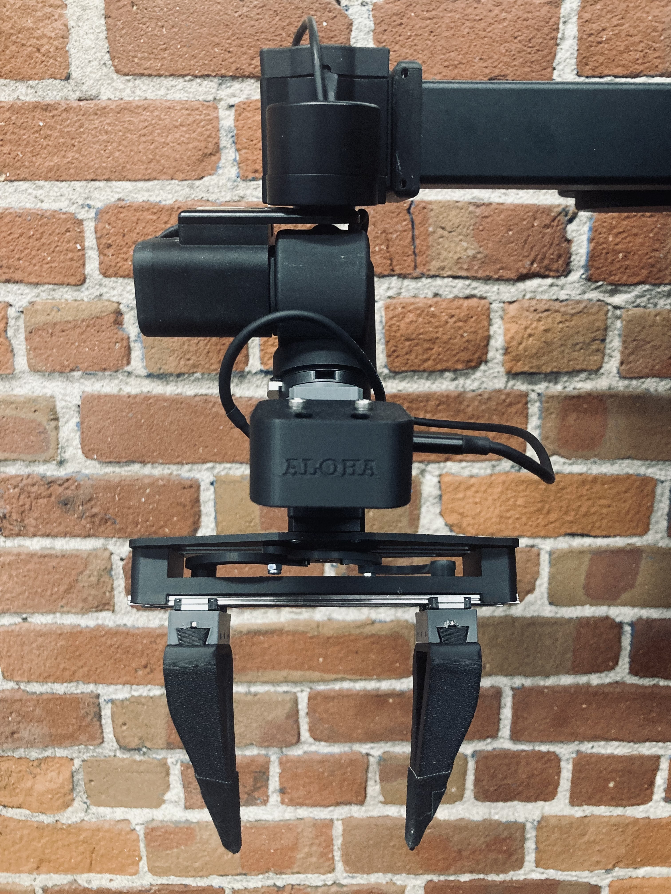

# Stretch 3 Aloha Gripper Implementation

> **Important:**
>
> Always fully power off the robot before installing or removing the Aloha Gripper.
>
> Do not connect or disconnect the gripper while the robot is powered on, as this may damage the Dynamixel servos or communication bus.
>
> After installing or removing the gripper hardware, power the robot back on before continuing with the software configuration steps.

<div align="center">
  
</div>


### 1. Uninstall existing Stretch Body

```bash
pip3 uninstall hello-robot-stretch-body
```

### 2. Install Stretch Body Locally from the branch

```bash
cd ~/repos
git clone https://github.com/hello-robot/stretch_body
cd stretch_body
git pull
git checkout feature/aloha_gripper_on_latest
pip3 install -e body/
```

### 3. Scan and make sure the gripper Dynamixel Motor is reachable

```bash
REx_dynamixel_id_scan.py /dev/hello-dynamixel-wrist
```

Expected Output:

```bash
Scanning bus /dev/hello-dynamixel-wrist
Checking ID 0
Checking ID 1
.
.
Checking ID 13
[Dynamixel ID:013] ping Succeeded. Dynamixel model : XC430-W240. Baud 115200
Checking ID 14
Checking ID 15
[Dynamixel ID:015] ping Succeeded. Dynamixel model : XM540-W270. Baud 115200
Checking ID 16
[Dynamixel ID:016] ping Succeeded. Dynamixel model : XM430-W350. Baud 115200
Checking ID 17
[Dynamixel ID:017] ping Succeeded. Dynamixel model : XM430-W350. Baud 115200
.
.
Found 4  servos on bus /dev/hello-dynamixel-wrist
```

### 4. Configure Parameters

Edit `stretch_user_params.yaml`:

```bash
cd $HELLO_FLEET_PATH/$HELLO_FLEET_ID
nano stretch_user_params.yaml
```

Replace its content with the following:

```bash
robot:
  tool: eoa_wrist_dw3_aloha_gripper
  use_collision_manager: 0
stretch_gripper:
  range_t: [<fully-closed-ticks>, <fully-open-ticks>]
  zero_t: <homing-ticks>
eoa_wrist_dw3_aloha_gripper:
  stow:
    wrist_pitch: -0.7
```

Before filling in the values above, you must first determine:

- `<fully-closed-ticks>` → servo ticks when the Gripper is fully closed
- `<fully-open-ticks>` → servo ticks when the Gripper is fully open
- `<homing-ticks>` → servo ticks used as the Gripper homing position

You will use the `REx_dynamixel_jog.py` tool to retrieve these values.


* Enter the dynamixel jog cli tool:
	```bash
	REx_dynamixel_jog.py /dev/hello-dynamixel-wrist 17
	```

* Enter `h` show the current homing offset and verify if it is Zero, if not enter `o` to set it to zero.

* Enter `d` to disable the torque, allowing you to back drive the gripper. Enter `j` to show the current ticks position of the servo.

* Note down the ticks position when the Gripper is fully open and fully closed.

* The Zero pose, which is basically the gripper’s homing pose, can be any value between the Fully Open and Fully Closed position ticks, depending on the user’s requirements.


### 5. Create Temporary Aloha Gripper URDF

> Note:
> Until a dedicated Aloha Gripper URDF is added upstream, create a temporary URDF by duplicating the SG3 Pro description.

```bash
cd /home/hello-robot/.local/lib/python3.10/site-packages/stretch_urdf/SE3/
cp stretch_description_SE3_eoa_wrist_dw3_tool_sg3_pro.urdf stretch_description_SE3_eoa_wrist_dw3_aloha_gripper.urdf
```


### 6. Launch Gamepad Teleop

```bash
stretch_gamepad_teleop.py
```

You can find the Gamepad teleoperation docs here: https://docs.hello-robot.com/0.3/getting_started/hello_robot/#gamepad-teleoperation.

### 7. Web Teleop

Switch to the aloha branch implementation:
```bash
cd ~/ament_ws/src/stretch_web_teleop
git pull
git checkout feature/aloha_gripper
```

Build and source ROS 2 workspace:

```bash
cd ~/ament_ws
colcon build --packages-select stretch_web_teleop
source install/setup.bash
```

Launch Web Teleop

```bash
cd ~/ament_ws/src/stretch_web_teleop/
./launch_interface.sh
```


In the terminal, you will see output similar to:


```bash
Visit the URL(s) below to see the web interface:
https://localhost/operator
https://172.17.0.1/operator
https://10.1.10.168/operator
#############################################
```

Look for a URL like `https://<ip_address>/operator`. Visit this URL in a web browser on your personal laptop or desktop to see the web interface. Ensure your personal computer is connected to the same network as Stretch. You might see a warning that says "Your connection is not private". If you do, click `Advanced` and `Proceed`.

Once you're done with the interface, close the browser and run:


```bash
./stop_interface.sh
```

You can find the Web Teleoperation docs here: https://github.com/hello-robot/stretch_web_teleop.

### 8. Switching Back to the Original Gripper

If you plan to switch back to the original gripper, you will need to follow these steps:

#### 1) Uninstall the local editable branch:
```bash
pip3 uninstall -y hello-robot-stretch-body
```

#### 2) Reinstall the original version from PyPI:
```bash
pip3 install hello-robot-stretch-body
```
This will restore your environment to the exact state it was in before you tested the Aloha gripper branch.

#### 3) Edit `stretch_user_params.yaml` back to its original content: 
```yaml
#User parameters
#You can override nominal settings here
#USE WITH CAUTION. IT IS POSSIBLE TO CAUSE UNSAFE BEHAVIOR OF THE ROBOT 
robot:
  use_collision_manager: 0
```

#### 4) Change both branches from `stretch_body` and `stretch_web_teleop` to master:
```bash
cd ~/repos/stretch_body
git checkout master

cd ~/ament_ws/src/stretch_web_teleop
git checkout master
```

#### 5) Run a system check to ensure everything is up to date:
```bash
stretch_system_check.py -v
```
